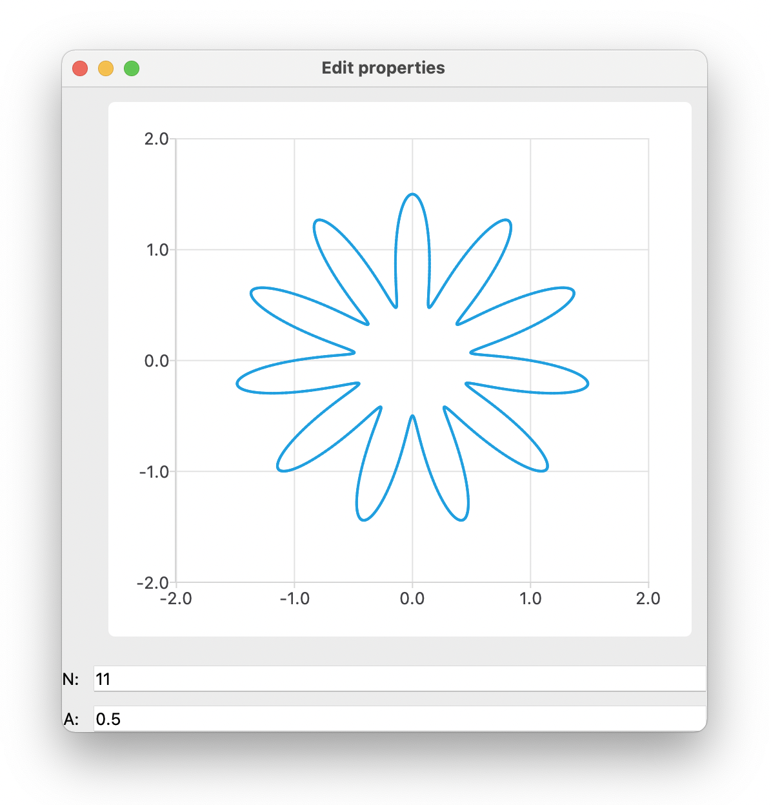

# traitsui-sandbox

Scratch files for playing with TraitsUI for hardware automation.

The primary focus here is on plotting and graphing. I really like how [Holoviews](http://holoviews.org) and 
[Bokeh](https://bokeh.org) work, but the constraints of running in a browser keep tripping me up for interacting with
hardware. [TraitsUI](https://docs.enthought.com/traitsui/) is great, but plotting isn't built in. I have tried 
embedding matplotlib (which I like for static plots), but every time I make a GUI with it, I end up unhappy with the 
speed. Here I'm trying to use faster plotting packages with TraitsUI to see if they're a workable alternative. I'll 
start with PyQtChart.

Here's a successful embed example from [traitsui_pyqtchart.py](traitsui_pyqtchart.py):
